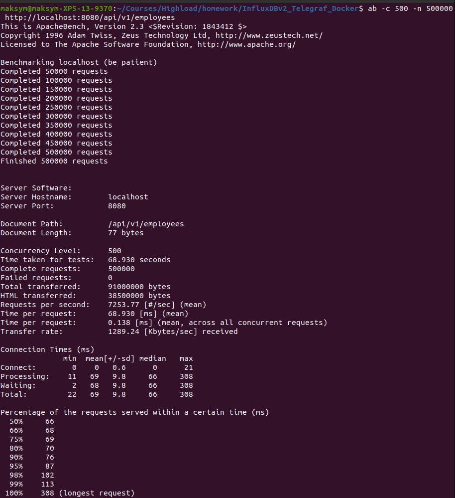
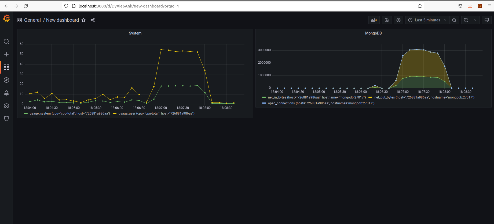

# Homework 2
Using the TIG Stack for Monitoring

## Description:
The telegraph is used to collect indicators from the system and MongoDB.  
Telegraf writes data to the InfluxDB database.  
Grafana is used to draw graphs.  

## Launch:
1 Download the repository  
2 Run `docker-compose up -d` to start containers  
3 Wait until everything is assembled and launched. To check the status of the application you can use this command: `docker logs l2_app_1 -f`
4 Run the script to load the datasource and dashboard into Grafana, fill MongoDB with data `sh ./init.sh`   
5 Run load testing `ab -c 500 -n 500000 http://localhost:8080/api/v1/employees`  
6 Open Grafana http://localhost:3000. Login: admin, password: password. Open "New dashboard" dashboard

## Useful commands
- Run containers in the background  
docker-compose up -d

- See running container  
docker container ls

- Login to container by using container name  
docker exec -it mongodb bash

- Login to MongoDB with created User and Database  
mongo -u admin -p password --authenticationDatabase EmployeeDB

- Get data from the application  
http://localhost:8080/api/v1/employees

- Influxdb database list  
curl -G http://localhost:8086/query?pretty=true --data-urlencode "db=glances" --data-urlencode "q=SHOW DATABASES"

## Grafana notes
Datasource export:
1. Create datasource in Grafana
2. Download it by executing of the http://localhost:3000/api/datasources request
3. Remove id, uid fields, set "null" value to the target->datasource objects

Dashboard export:
1. Create dashboard in Grafana
2. Download it by executing of the http://localhost:3000/api/dashboards/uid/<uid> request
3. Remove id, uid fields, set "isDefault": true

## Useful links

- SpringBoot MongoDB example  
https://www.javaguides.net/2019/12/spring-boot-mongodb-crud-example-tutorial.html  

- Docker MongoBD configuration  
https://stackoverflow.com/questions/42912755/how-to-create-a-db-for-mongodb-container-on-start-up  

- Running InfluxDB 2.0 and Telegraf Using Docker  
https://www.influxdata.com/blog/running-influxdb-2-0-and-telegraf-using-docker/  

- Run Grafana Docker image  
https://grafana.com/docs/grafana/latest/installation/docker/  

- Grafana Configuration  
https://grafana.com/docs/grafana/latest/administration/configuration/  

- Configure a Grafana Docker image  
https://grafana.com/docs/grafana/latest/administration/configure-docker/  

- Provision dashboards and data sources  
https://grafana.com/tutorials/provision-dashboards-and-data-sources/  

