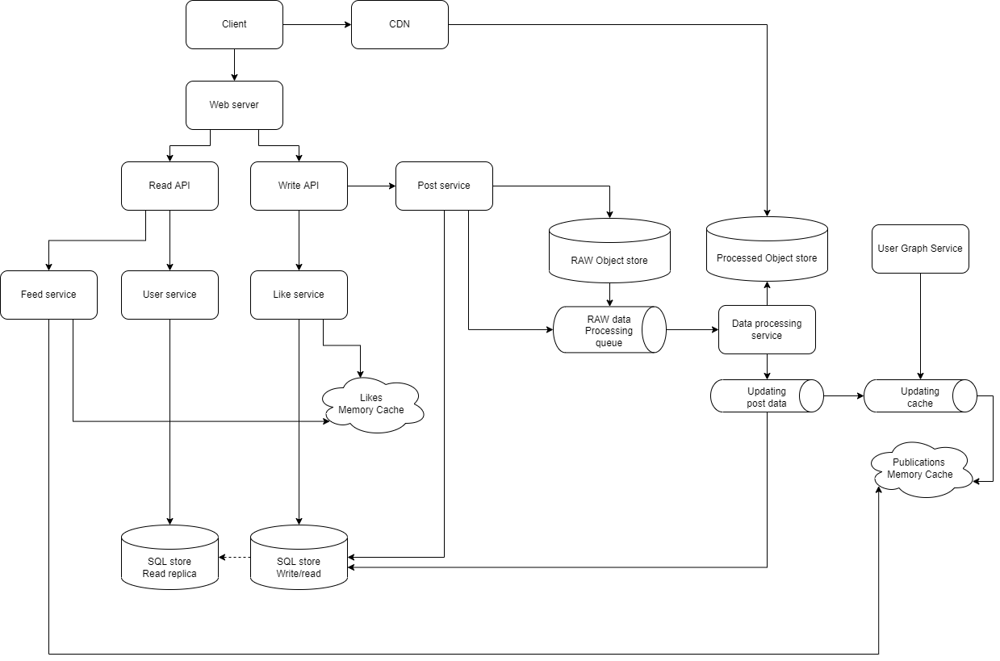

## Добавить пост с текстом и/или фотографией:
    1. запрос на веб-сервер;  
    2. перенаправление на Write API;  
    3. перенаправление на Post service;  
    4. сохранение текста в реляционную базу данных;  
    5. запись фотографии в RAW файловое хранилище;  
    6. отправка задания в очередь по обработке фотографий (валидация, форматирование), запись в Processed Object Store; (?)  
    4. сохранение ID фотографии в реляционную базу данных;  
    7. получание друзей пользователя из User Graph Service;  
    8. добавление ID публикации в Publication Memory Cache всем друзьям;  

## Добавить пост с текстом и/или с видео:
    1. запрос на веб-сервер;  
    2. перенаправление на Write API;  
    3. перенаправление на Post service;  
    4. сохранение текста в реляционную базу данных;  
    5. запись видео в RAW файловое хранилище;  
    6. отправка задания в очередь по обработке видео (валидация, перекодирование, нарезка на части), запись в Processed Object Store, создание плейлистов;  
    4. сохранение ID видео в реляционную базу данных; (предполагается, что в дальнейшем, при получении контента, клиент будет отправдять ID и метаданные, а бек будет принимать решение какой плейлист отдать. Подозреваю это не совсем правильно)  
    6. получание друзей пользователя из User Graph Service;  
    7. добавление ID публикации в Publication Memory Cache всем друзьям;  

## Просмотреть свою страницу:
    1. запрос на веб-сервер;  
    2. перенаправление на Read API;  
    3. перенаправление на User service;  
    4. получение ID последних постов;  
    5. чтение из реляционной базы данные данные по посту (текст, ID изображения и видео)  
    6. фронт через CDN получает изображения и видео.   

## Просмотреть чужую страницу:
    1. То же что и на шаге "Просмотреть свою страницу", только по другому ID.  

## Просмотреть ленту:
    1. запрос на веб-сервер;  
    2. перенаправление на Read API;  
    3. перенаправление на Feed service;  
    4. чтение из Publication Memory Cache публикаций друзей по ID пользователя.  
    5. чтение из реляционной базы данные данные по посту (текст, ID изображения и видео)  
    6. фронт через CDN получает изображения и видео.   

## Просмотреть публикацию:
    1. запрос на веб-сервер;  
    2. перенаправление на Read API;  
    3. перенаправление на Post service;  
    4. чтение из кеша по ID текста, фото, плейлиста видео;  
    5. чтение лайков из Likes memory cache;  
    6. фронт через CDN получает данные.   

## Поставить лайк:
    1. запрос на веб-сервер;  
    2. перенаправление на Write API;  
    3. перенаправление на Likes service;  
    4. создание / инкрементирование счётчика лайков в Likes memory кеше по ID поста;  
    5. (?) отправка в очередь для записи значения в реляционную базу  
            (?) или батчами сохранять кеш на диск.  
